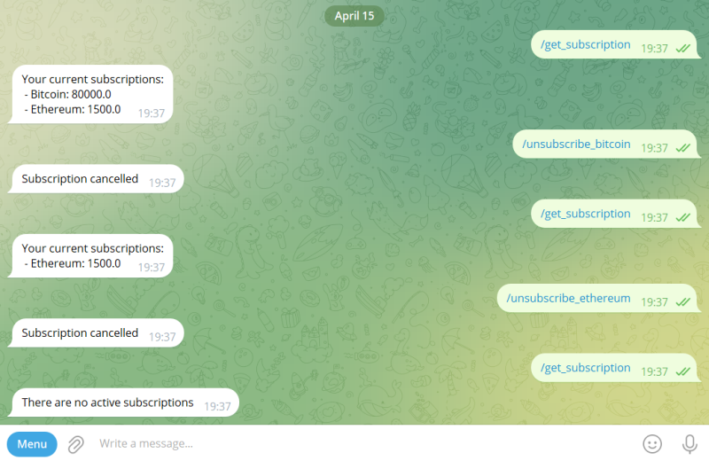
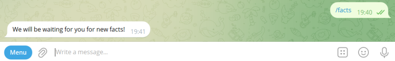

<a id="anchor"></a>
# TelegramCryptoBot
____
_Stack_:
Java 17, Spring Boot, Gradle, PostgreSQL, Hibernate,
API Telegram Bot, Rome, Lombok, Slf4j.
____

TelegramCryptoBot - это инструмент, который следит за 
ценой актива и уведомляет пользователя о том, 
что его стоимость достигла желаемого уровня. 
Данный бот представляет собой Spring-приложение,
которое работает с локально установленной базой данных 
PostgreSQL, и взаимодействует с пользователем через
кроссплатформенный мессенджер Telegram.

Архитектура бота написана для дальнейшего расширения.
В представленном приложении реализовано отслеживание
двух криптовалют: Bitcoin и Ethereum. Приложение 
использует внешние источники данных для
получения цены криптовалют и новостей. Есть разделенная
логика команд для пользователей и администратора, а 
так же дополнительный развлекательный контент.

____

### Принципа работы бота:

* В боте реализовано меню, для удобства использования, 
  с кратким описанием команд.


* /start - при запуске бота выводит приветственное
  сообщение, содержащее доступные команды. Так же, данная
  команда регистрирует нового пользователя в базе данных.


* _/get_price_bitcoin_ 
и _/get_price_ethereum_ - бот использует внешние источники
и выводит стоимость запрошенной криптовалюты.


* _/subscribe_bitcoin_ и _/subscribe_ethereum_ -
  команды подписки на стоимость криптовалюты. 


* При достижении
  необходимой суммы бот уведомляет об этом пользователя.
  Периодичность уведомления установлена в application и по
  дефолту составляет 10 минут.


* _/get_subscription_ - выводит список подписок.
* _/unsubscribe_bitcoin_ и _/unsubscribe_ethereum_ -
  удаление подписок.



* _/content_ - вызывает список развлекательного контента.


* _/news_ - бот использует внешние источники
  и выводит заголовки свежих новостей из мира 
  криптовалюты со ссылками на них.


* _/facts_ - интересные факты о мире криптовалюты. 
  Сообщения заменяют друг друга при взаимодействии.




* _/send_message_ - команда администратора, для рассылки
  сообщений всем пользователям.


* _/fact_parse_ - команда для парсинга json файла. 
  Если количество фактов не изменилось, можно
  заменить факты в базе данных из нового json файла.


____

### Руководство по запуску:


В папке resources создать файл:

```yaml
config.yml
```

В данном файле установить значения для следующих 
переменных:

```yaml
BOT_NAME: Имя бота
BOT_TOKEN: Токен бота

DB_NAME: логин базы данных PostgreSQL
DB_PASSWORD: пароль базы данных PostgreSQL

ADMIN_ID: собственный telegram id 
```

Самый простой способ узнать свой telegram id это 
посмотреть его в базе данных при первом запуске бота.

Для получения токена следуйте
[инструкции](https://core.telegram.org/bots/features#creating-a-new-bot).

[вверх](#anchor)